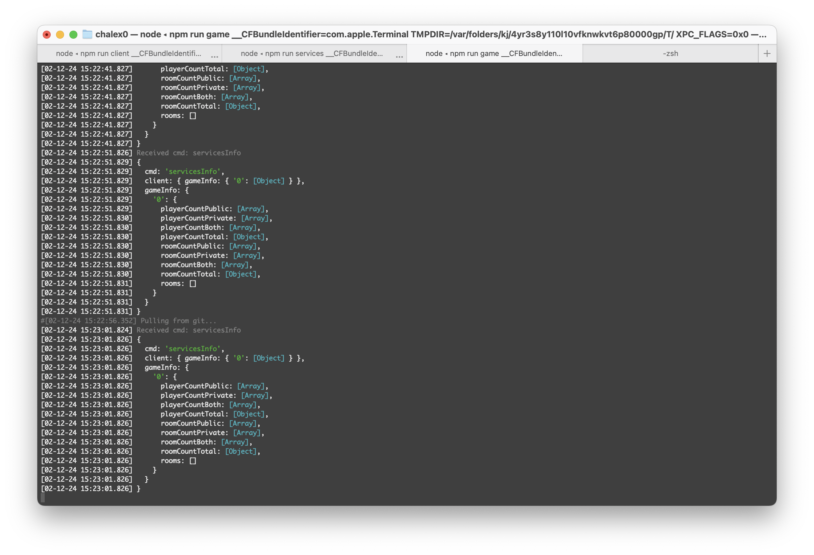

# LegacyShell
> No clucks given.

Remake of Shell Shocker's web servers, for a classic version. Then, maybe even extending it.

## Forewarning:

> [!CAUTION]  
> LegacyShell is currently in active development and is not ready for production use. Tables in databases may appear or disappear between updates and configs will need manually updating.

## Explanation:
In order to emulate all the parts of the webgame shellshock.io, one must replicate the following:


| **Component** | **Purpose** | **Notes** |
|-------------------------|---------------------------------------------------------------------------------------------------------------------------------------------------------------------------------------------------------------------------------------------------|-------------------------------------------------------------------------------------------------------------------------------------------------------------------|
| **Services Server** | This is the central server that does all non-gameplay things, eg stores account info, updates the info when getting kills.<br>This server should also deal with things like Twitch streams, info, news, listing available websocket servers and so on.| - There can only be one, unless there is some way to sync the data across them.|
| **Client Server** | Providing the files needed to play the game in the browser, eg the js, html, images, etc.|- There can be as many of these to act as mirrors as desired. Just they will need to be configured to connect to the services server.|
| **Game Server** | This server allows gameplay to take place. It simulates the game being played and sends packets to all the players, keeping them in sync.|- So long as the game server is added and authorised by the owner of the services server, then there can be as many as desired to increase the region count.|

So depending on your use case, you could either be using all or some of the servers.

## Contributing

We accept PRs to the LS project for security, bugfixes, code efficiency and feature improvements. You can also submit new features, but so long as you can answer the question:

> **"Could this be a plugin?"**

LegacyShell has an existing and potentially powerful modding API built in. If you want to add, for instance, a gamemode then do consider making it a plugin if possible. If the lack of modding listeners is holding you back (which currently is likely as there are many use cases that we cannot forsee) then PRing the emitters necessary to make your plugin work will almost always be accepted.

Things such as extra skins, stamps or other cosmetic stuff will never be accepted into the base game, as though the base isn't not close to vanilla we want to minimise direct tampering with that experience. You can PR these into the LegacyShellCore plugin, but this is still up to the discretion of onlypuppy7/the LS contributors.

# Installation Instructions

## Prerequisites:
- Nodejs (bun or other replacements might work but are not supported)
  - These are some versions that have been used during development:
    - v18.19.0 on Raspberry PI Debian
    - v20.11.1 on Windows 11
    - v20.18.1 on M4 MacOS
  - LegacyShell should run on any system where modern versions of nodejs are supported, and no testing has been done on dev versions or deprecated ones.
- (Optional but highly recommended) Git
- Some kind of terminal

## Installation
1. Navigate to the root directory in your terminal of choice.
2. Enter: `npm install`
3. Enter: `npm run init` to set up the config (just roll with it for now).

> [!IMPORTANT]  
> If you get issues with installing the canvas package, try this:
> 
> ```
> sudo apt-get update
> sudo apt-get install -y libcairo2-dev libjpeg-dev libpango1.0-dev libgif-dev build-essential g++ > > pkg-config
> 
> sudo apt-get install libpixman-1-dev
> npm install
> ```
> 
> This is an issue known to affect unix based systems.

## Starting up the server

### Easiest method: Combined running

The simplest way to get going from the command line is just by entering:

`npm run all`

This will run all 3 components in one window/tab and is enough for anyone who isn't going to be delving into the code too much. This is all you need to do, and you can ignore the next section.

Assuming you haven't changed any ports, just navigate to: http://localhost:13370/

If you want to run a reduced amount of components, then this will not work for you, continue on to the next methods.

### Alt: Running with separated consoles

If you plan on actually looking at the log output and/or want to do any dev, then separating out the logs will be essential for debugging. 

LegacyShell provides startup scripts for Windows (.bat) and OSX/MacOS (.command). If you want the three processes to run in a single terminal window with tabs, use the `start_all_tabs` script, if you prefer three seperate terminal windows, use the `start_all` script.

<center>


<i>Example of using tabs. Clearly the superior method.</i>
</center>

### Alt: Manually starting the servers

If you are on a different platform such as Linux, or you prefer to start everything completely manually, run the following commands with three different terminal windows in the project's root folder:

- `npm run client`
- `npm run services`
- `npm run game`

For each, on Windows/MacOS there are also script files which can be executed by clicking.

There isn't any order for the execution, and all components will wait for each other to be initialised.

Personally I'd recommend combining this with something like tmux. This is how I operate the production instances.

> [!NOTE]  
> These commands and scripts will launch the server in a custom wrapper, designed to make keeping track of everything easy and configurable. It will restart in case of crashes, schedule daily restarts, log to files, automatically pull, restart upon updating and send logs to a Discord webhook (all dependent on config). To modify it's settings, modify the `perpetual_all.yaml`, config found in `/store/config/`.

# Navigating the database
The LegacyShellData.db database in /server-services/store houses most critical information.

> [!TIP]  
> These tags provide information about the function of the table:
> 
> (USER-EDITABLE) indicates that the table is *INTENDED* to be edited 
> 
> (SYS-EDITABLE) indicates that the table is *NOT DESIGNED* to be edited, but can still be edited if you know what you're doing
> 
> (SYS-READONLY) indicates that the table is *NOT INTENDED* to be edited, and doing so will have **no effect**, they can be **ignored and overwritten** by LegacyShell processes.

Here is a breakdown of the tables:

| **Table** | **"Tag"** | **Description** | **Notes** |
|-----------|-----------------|-------------------------------------------------------------------------------------------------------------------------------------------------------------------------------------------------------------------------------------------------------------------------------------|-------------------------------------------------------------------------------------------------------------------------------------------------------------------|
|**codes**|USER-EDITABLE|This table holds all item/egg codes that can be used.<br>To add codes, open the database in a SQL editor and add a row; a random code should be automatically generated. You can then edit other information as desired.<br>Once a code is completely used, it does not get deleted. Instead it stays be able to alert players that the code has been used up.|Codes may contain item(s), eggs, or both.<br>Codes may be set to be used multiple times, however can only be redeemed once per account.|
|**game_servers**|USER-EDITABLE|This table holds all authorised game servers.<br>To add an authorised game server, open the database in a SQL editor and add a row; a random auth code should be automatically generated. You can then edit other information as desired (name).<br>Rate limits are bypassed and sensitive operations are allowed to those with one.|Be cautious about who you give auth codes to, as one has the potential to ruin the integrity of your database (by flooding with kills and stuff).|
|**ip_requests**|SYS-EDITABLE|This table holds records about IPs in regard to ratelimit functions.|IPs are only stored until their timeout expires.|
|**items**|SYS-EDITABLE|This table holds records about all the items that the game recognises.<br>Providing that the correct models are present, here you can either change minor settings (such as price and if they should appear in the shop), or you can add new items entirely.|This table is user editable when no plugins are being used. Plugins which add items overwrite the table every time services starts.|
|**maps**|SYS-READONLY|This table holds records about the maps that the game recognises.<br>**You cannot directly edit this table**.<br>It is generated from the json files in /server-services/src/maps and it is intended to instead modify those files.<br>The json files in that directory are directly compatible with those exported from the Shell Shockers map editor.|To add maps, add jsons to the src folder or leverage a plugin (see LegacyShellCore)|
|**sessions**|SYS-EDITABLE|This table holds records about sessions and their associated ips and account ids.|This is not a very interesting table to look at.|
|**users**|SYS-EDITABLE|This table holds records about all registered accounts for the services server instance. You can change things like egg counts and inventories.||

# Models
egg.babylon contains hats and egg/hand models
