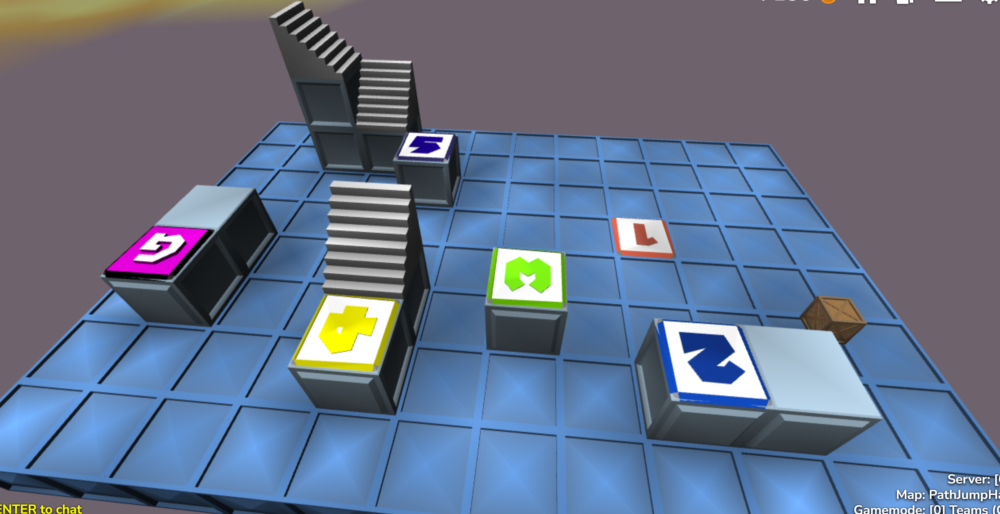

PathJumpHardTest text explanation

Checkpoint 1>2: jump off a small crate (aabb) onto full block
2>3 standard full to full jump across gap
3>4 another standard jump
4>5 walk up ramp and jump off at top onto full 1 y below
5>goal walk up a ramp, jump onto an adjacent ramp, then do a long fall jump onto final platform