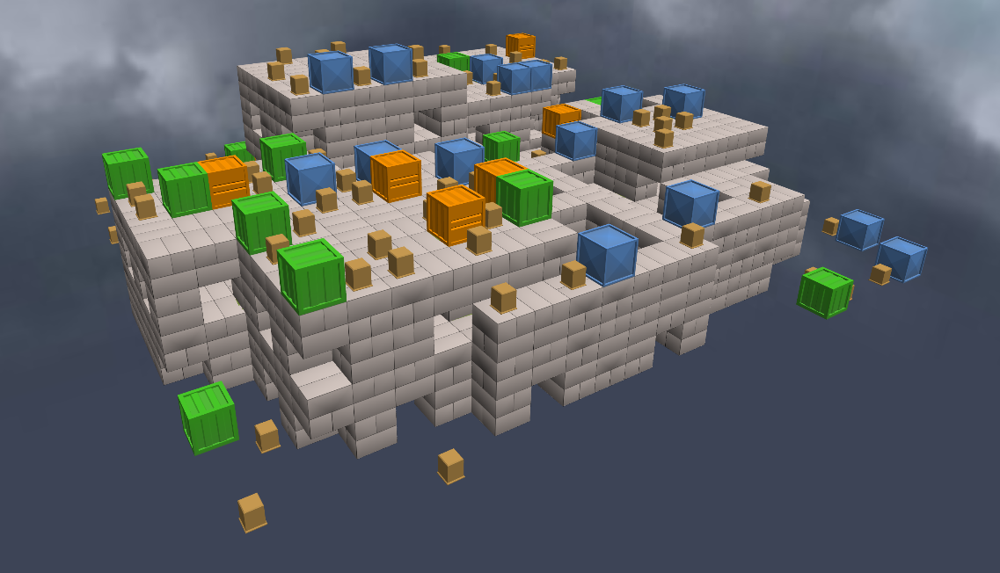
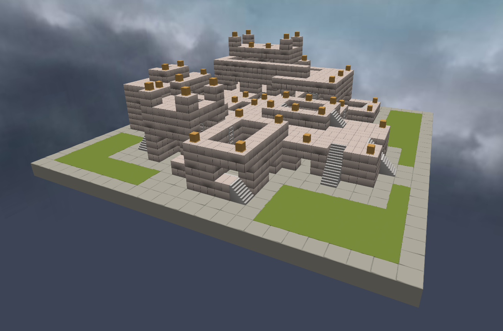
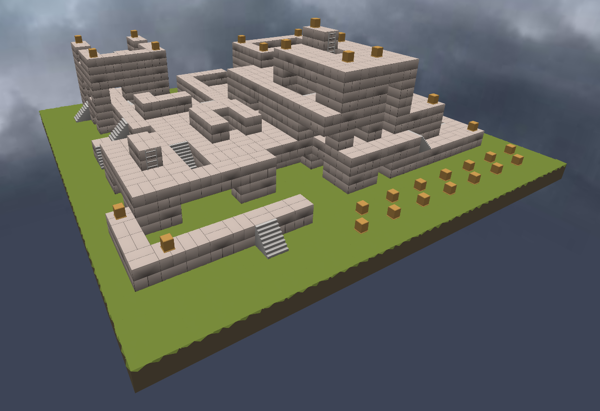
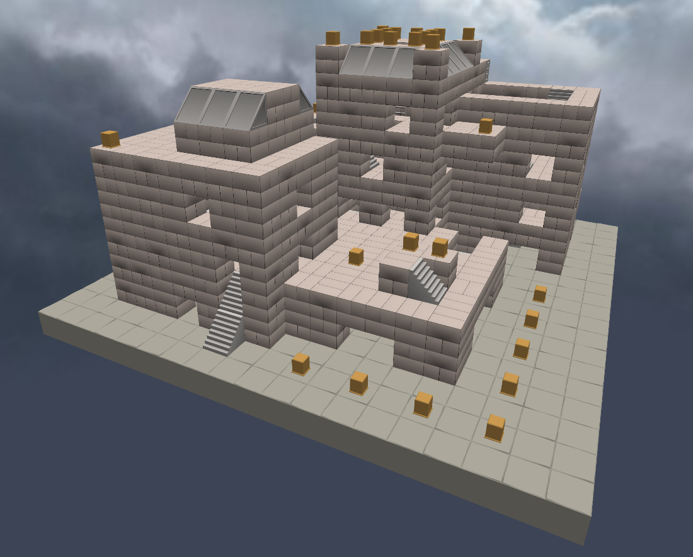

# Rough Shell Shockers Map History

## Randomly Genned Era

This era spans from the first release to the beginning of the [manually created era](#manually-created-era). Ie, before the map editor was made.

In the beginning, maps were just made via random number generators. Within early code there are functions for map generators that create based off of an initial seed. So either the maps themselves were baked into the code like they are in the [manually created era](#manually-created-era), or the seeds were bundled into the code, or the server sent the seed to the clients.

If it was determined by the server, then the preservation of these maps would be particuluary difficult due to the fact that there wasn't anything defined really in circulation. What I mean by this is that it would cause all the different maps found in videos to just have been temporary for that room and thus making it impossible to say that any one seed has particular importance.

Due to archiving for this era being practically non-existent save for some [YouTube videos](./updatestimeline.md), it's hard to determine how exactly the distribution of maps was achieved.

Since telling these maps apart isn't easy, the best way to ID them is to compare their corners. They usually contain fairly telling structures which act as their fingerprint.

### 0.0.4 - Flat + Crates

When the game launched, maps were nothing more than flat expanses with some piles of crates and stairs facilitating movement.

The following two screenshots are taken from different videos uploaded on [5 Sept 2017](https://www.youtube.com/watch?v=9YIXgrjLIXk) and [6 Sept 2017](https://www.youtube.com/watch?v=RV3A8cGYFgQ). As you can see, the map being played on is identical, supporting the idea that the first map ever was definitely defined somewhere, whether it was an actual json or just a seed.

<center>


*Note the blue Г shape on the left.*
</center>

Interestingly, the colours of the crates appears to change across videos, despite this the layout seems consistent.

<center>


*Here the green becomes blue and vice versa. Orange crates are unaffected, likely just due to chance.*
</center>

This could be explained by the fact that the oldest map jsons contained an attribute for decoration, of which the crates were part of. They may have simply just been shuffled every time the map was loaded.

```js
t.data[o][s][p].cat || c++, t.data[o][s][p] = l ? {
    cat: 1,
    dec: 4,
    dir: Math.seededRandomInt(0, 4)
} : s % 2 == 0 ? {
```
<center>

*Code taken from 0.9.0's js.*

</center>

Here are more screenshots showing the layout of this map. This map is featured in videos which document 0.0.4.

<center>


</center>


### 0.1.0 - Flat + Crates

With 0.1.0 came a new map, which is probably from the exact same generator just with a different seed. This map is only seen in one video, which was a livestream.

<center>


*One identifiable feature is the big obelisk in the corner of the map.*


*Another is this 1x3 section.*
</center>

More screenshots.
<center>


</center>

### 0.1.2 - Flat + Crates

This map is seen in several videos, from [10 Sept 2017](https://youtu.be/4XhxtmXu2Gc) to [14 Sept 2017](https://www.youtube.com/watch?v=Fl5v2SwZPy0).

<center>


*Clearly the layout is identical.*


*[The 4 corners of the map](https://www.youtube.com/watch?v=Fl5v2SwZPy0).*
</center>

### 0.2.0 - Flat + Crates

This is a map that appeared in 0.2.0, due to the video being short there isn't much available to ID it.

<center>


*[1 and a half corners of the map](https://www.youtube.com/watch?v=jWOLQNVGu3I).*
</center>

### 0.2.0? - Flat + Crates

This video doesn't have a confirmed version.

<center>


*[3 corners of the map](https://www.youtube.com/watch?v=xgbEjZijSfQ). Don't ask me why his expression doesn't change. I don't know either.*
</center>

### 0.4.0 - Flat + Crates

<center>


*[3 corners of the map (2 are of the same)](https://www.youtube.com/watch?v=J6BHzEU7C6s).*
</center>

### 0.4.? - Flat + Crates

<center>


*[The 4 corners of the map.](https://www.youtube.com/watch?v=crw7PW-ZaMQ)*
</center>

More screenshots:

<center>


*The identifiable corner structure.*
</center>

### 0.4.2-0.4.3 - Flat + Crates

<center>


*[3 corners of the map (2 are of the same)](https://www.youtube.com/watch?v=Sjv6BwxNsOc)*
</center>

This is one of the rare times that a randomly generated map has appeared across versions.

<center>


</center>

### 0.6.0 - Flat + Crates

<center>


*[3 corners of the map (2 are of the same)](https://www.youtube.com/watch?v=_lOkrMy5OpY)*
</center>

More screenshots:

<center>


</center>

## Inter-Editor Era

This era is defined by its presence of maps which are ambiguous as to whether or not they are actually handmade, generated, or a mix of the two.

The first public mentioning of the map editor was on [16th October 2017](https://www.facebook.com/ShellShockersGame/posts/pfbid0MveedmUki6MLMo73t6LZ9yxAZiAxRjdky6K2EeymVy8V9KXKH9kEc1qZC9iwjYTPl). Therefore it might be implied that every map seen prior to this date was randomly generated, and accordingly every map afterwards has been manually created.

As stated previously, early versions of Shell contained a map generator built in. Although there are no references to it, we can extract the code and put it to use in alternative ways. Thus, I built it into the LegacyShell map editor to see what it can output.

<center>


*Output from my modified Legacy Generator.*
</center>

As you will see, this sort of output is similar in structure to the upcoming maps - ignoring its lack of floor, stairs and ladders. It's actually this lack of decorations that leads me to think that these next maps may actually have been initially created using this generator as a base and then "crafted" to be more playable.

Unfortunately the WayBack Machine drought continues until 0.9.0. So that version is the earliest we can verifiably analyse and export maps from.

### The 0.7.x Maps - #1

There are two maps I could find for this version.

<center>


*[3 corners of the map (2 are of the same)](https://www.youtube.com/watch?v=_lOkrMy5OpY)*
</center>

More screenshots:

<center>


</center>

### The 0.7.x Maps - #2

This is the second map. By doing our corner analysis, this is clearly not the same map, but stylistically is identical.

<center>


*[3 or 4 corners of the map, I couldn't be bothered to verify.](https://www.youtube.com/watch?v=FnaKFU-yt1c)*
</center>

### The 0.8.x Maps - #1

Interestingly in this update cycle we see the reintegration of the visually jarring and randomly scattered crate blocks. They were omitted from 0.7.x's, but here make their final appearance doing the thing they were originally made to do: be everywhere and get in the way.

<center>


*[Some corners, or something, I'm tired of this.](https://www.youtube.com/watch?v=UZSnvnNg8Qk)*
</center>

More screenshots:

<center>


</center>

### The 0.8.x Maps - #2

<center>


*[At least 3 corners here.](https://www.youtube.com/watch?v=YSDzwIz_y2Y)*
</center>

More screenshots:

<center>


</center>

### The 0.9.x Maps

These are maps that have been found in the files of 0.9.0.

Reading from the official 0.9.0 changelog:

> **What's New**
> - Hand-crafted maps (Sorta!)

It's up to you to decide what that makes the other Inter-Editor maps. Just visually I personally don't see too huge a difference here, other than grass, slopes and other minor things. I'm going to believe that these are edited from generated maps, explaining the `(Sorta!)` in the changelog.

From analysing videos from the time period, these were from around [2 Dec 2017](https://www.youtube.com/watch?v=NkZKCQcHa5k) - 31 Dec 2017, thus placing them to exist in the 0.9.x update cycle. Maps which we know today started appearing in 0.10.0.

These maps come without a name, so they have been assigned some.

|Name|Videos|Image|Description|
|-|-|-|-|
|Alpha1|[Video 1](https://youtu.be/AYeGbwtRVqg?t=129)|||
|Alpha2|||Contains some areas reminiscent of Blue|
|Alpha3|[Video 1](https://youtu.be/0Gi4NultfvM?t=141)<br>[Video 2](https://youtu.be/v5eV43DHFZY?&t=29)||The inclusion of the generic slopes is especially interesting considering they don't appear in 0.10.x|

## Manually Created Era

This era is the one which marked the beginning of when maps started being added which actually stuck around. All prior maps have never returned.

### The 0.10.x Maps

Like 0.9.x, this version also contains just three maps.

Blue is often wrongly cited to be the oldest map, when it's just the oldest to still be in the game, along with Two Towers. Clearly as shown previously its far from the first.

|Name|Videos|Image|Description|
|-|-|-|-|
|Early Blue|[Video 1](https://youtu.be/cxJESkZzhkk?t=289)|||
|Early Bedrock|[Video 1](https://youtu.be/xyT6_v7H_vs?t=342)<br>[Video 2](https://youtu.be/gemfbFnaGxY)||Removed but then readded as [Bedrock](https://shellshockers.fandom.com/wiki/Bedrock?file=BedrockMap.png).|
|Early Two Towers|[Video 1](https://youtu.be/xyT6_v7H_vs?t=656)|||

The most significant thing to note here is the presence of an early version of Bedrock. It was later readded on 1st May 2023.

Scrutinising these maps further, I think that all these maps were also made with the same techniques as the [inter-editor era](#inter-editor-era), just with some block types replaced with new models.

It's most visible in Bedrock, obviously, as it's essentially another map like those in 0.9.x. Then looking at Blue, it's the same style just with grass and blue blocks. Then there's Two Towers. Despite the name, does it really look like two towers? Not to me. It looks too similar to the output of the Legacy Generator when you set the height to be large. 

So to conclude even though these maps have all prevailed, it's hard for me to call them manually created. But I will because I can. 