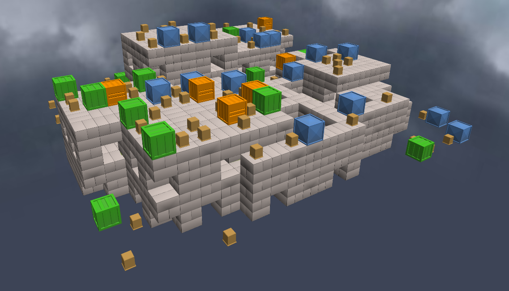
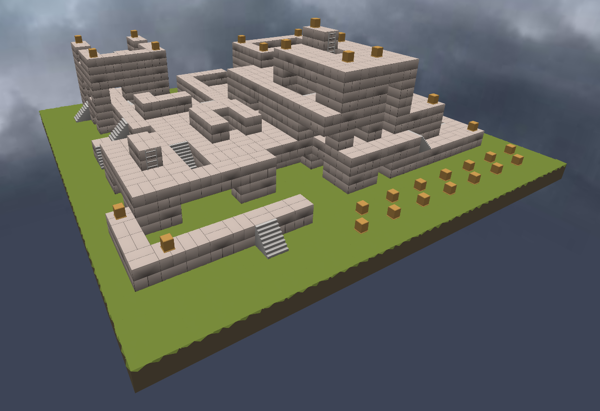
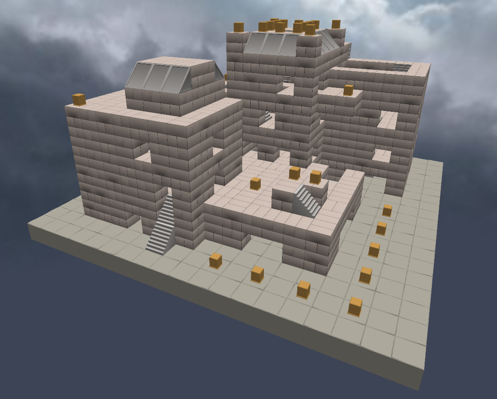
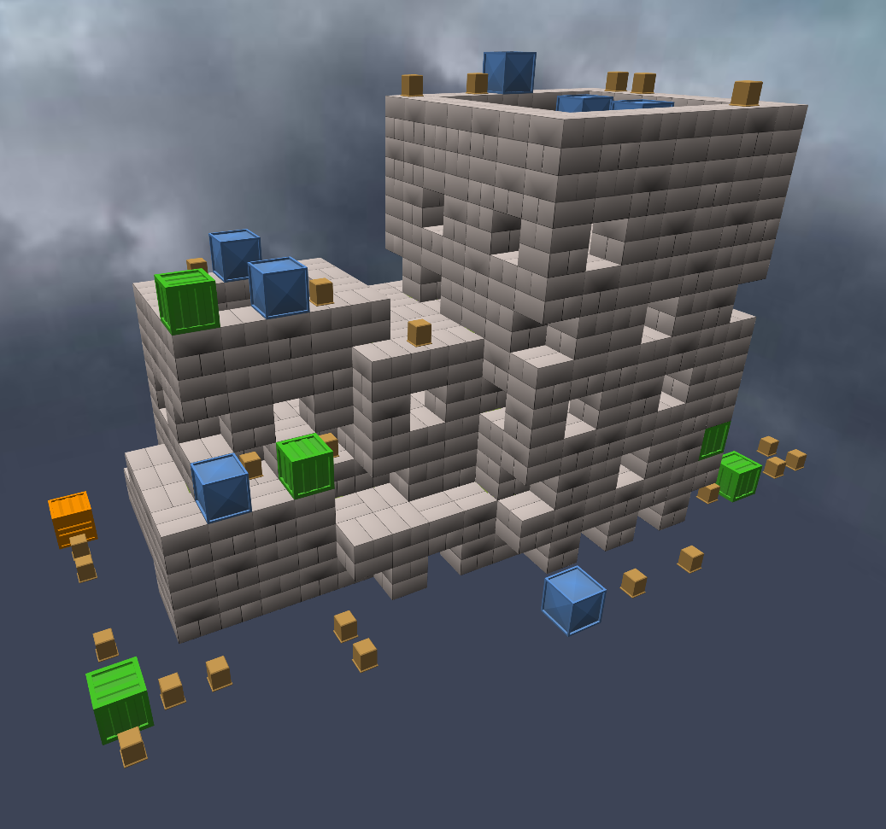

# Rough Shell Shockers Map History

## Randomly Genned Era

This era spans from the first release to the beginning of the [manually created era](#manually-created-era). Ie, before the map editor was made.

In the beginning, maps were just made via random number generators. Within early code there are functions for map generators that create based off of an initial seed. So either the maps themselves were baked into the code like they are in the [manually created era](#manually-created-era), or the seeds were bundled into the code, or the server sent the seed to the clients.

If it was determined by the server, then the preservation of these maps would be particuluary difficult due to the fact that there wasn't anything defined really in circulation. What I mean by this is that it would cause all the different maps found in videos to just have been temporary for that room and thus making it impossible to say that any one seed has particular importance.

Due to archiving for this era being practically non-existent save for some [YouTube videos](./updatestimeline.md), it's hard to determine how exactly the distribution of maps was achieved.

Since telling these maps apart isn't easy, the best way to ID them is to compare their corners. They usually contain fairly telling structures which act as their fingerprint.

### 0.0.4 - Flat + Crates

When the game launched, maps were nothing more than flat expanses with some piles of crates and stairs facilitating movement.

The following two screenshots are taken from different videos uploaded on [5 Sept 2017](https://www.youtube.com/watch?v=9YIXgrjLIXk) and [6 Sept 2017](https://www.youtube.com/watch?v=RV3A8cGYFgQ). As you can see, the map being played on is identical, supporting the idea that the first map ever was definitely defined somewhere, whether it was an actual json or just a seed.

<center>


*Note the blue Г shape on the left.*
</center>

Interestingly, the colours of the crates appears to change across videos, despite this the layout seems consistent.

<center>


*Here the green becomes blue and vice versa. Orange crates are unaffected, likely just due to chance.*
</center>

This could be explained by the fact that the oldest map jsons contained an attribute for decoration, of which the crates were part of. They may have simply just been shuffled every time the map was loaded.

```js
t.data[o][s][p].cat || c++, t.data[o][s][p] = l ? {
    cat: 1,
    dec: 4,
    dir: Math.seededRandomInt(0, 4)
} : s % 2 == 0 ? {
```
<center>

*Code taken from 0.9.0's js.*

</center>

Here are more screenshots showing the layout of this map. This map is featured in videos which document 0.0.4.

<center>


</center>


### 0.1.0 - Flat + Crates

With 0.1.0 came a new map, which is probably from the exact same generator just with a different seed. This map is only seen in one video, which was a livestream.

<center>


*One identifiable feature is the big obelisk in the corner of the map.*


*Another is this 1x3 section.*
</center>

More screenshots.
<center>


</center>

### 0.1.2 - Flat + Crates

This map is seen in several videos, from [10 Sept 2017](https://youtu.be/4XhxtmXu2Gc) to [14 Sept 2017](https://www.youtube.com/watch?v=Fl5v2SwZPy0).

<center>


*Clearly the layout is identical.*


*[The 4 corners of the map](https://www.youtube.com/watch?v=Fl5v2SwZPy0).*
</center>

### 0.2.0 - Flat + Crates

This is a map that appeared in 0.2.0, due to the video being short there isn't much available to ID it.

<center>


*[1 and a half corners of the map](https://www.youtube.com/watch?v=jWOLQNVGu3I).*
</center>

### 0.2.0? - Flat + Crates

This video doesn't have a confirmed version.

<center>


*[3 corners of the map](https://www.youtube.com/watch?v=xgbEjZijSfQ). Don't ask me why his expression doesn't change. I don't know either.*
</center>

### 0.3.2 - Flat + Crates

Version is kinda foggy and unconfirmed.

<center>


*[The 4 corners of the map.](https://www.youtube.com/watch?v=crw7PW-ZaMQ)*
</center>

More screenshots:

<center>


*The identifiable corner structure.*
</center>

### 0.4.0 - Flat + Crates

<center>


*[3 corners of the map (2 are of the same)](https://www.youtube.com/watch?v=J6BHzEU7C6s).*
</center>

### 0.4.2-0.4.3 - Flat + Crates

<center>


*[3 corners of the map (2 are of the same)](https://www.youtube.com/watch?v=Sjv6BwxNsOc)*
</center>

This is one of the rare times that a randomly generated map has appeared across versions.

<center>


</center>

### 0.5.0 - Flat + Crates

<center>


*[3 corners of the map](https://www.youtube.com/watch?v=_lOkrMy5OpY)*
</center>

More screenshots:

<center>


</center>

### 0.6.0 - Flat + Crates

<center>


*[3 corners of the map (2 are of the same)](https://www.youtube.com/watch?v=_lOkrMy5OpY)*
</center>

More screenshots:

<center>


</center>

## Inter-Editor Era

This era is defined by its presence of maps which are ambiguous as to whether or not they are actually handmade, generated, or a mix of the two.

The first public mentioning of the map editor was on [16th October 2017](https://www.facebook.com/ShellShockersGame/posts/pfbid0MveedmUki6MLMo73t6LZ9yxAZiAxRjdky6K2EeymVy8V9KXKH9kEc1qZC9iwjYTPl). Therefore it might be implied that every map seen prior to this date was randomly generated, and accordingly every map afterwards has been manually created.

As stated previously, early versions of Shell contained a map generator built in. Although there are no references to it, we can extract the code and put it to use in alternative ways. Thus, I built it into the LegacyShell map editor to see what it can output.

<center>


*Output from my modified Legacy Generator.*
</center>

As you will see, this sort of output is similar in structure to the upcoming maps - ignoring its lack of floor, stairs and ladders. It's this lack of decorations that leads me to think that these next maps may actually have been initially created using this generator as a base and then "crafted" to be more playable.

Unfortunately the WayBack Machine drought continues until 0.9.0. So that version is the earliest we can verifiably analyse and export maps from.

### The 0.7.x Maps - #1

There are three maps I could find for this version.

<center>


*[3 corners of the map (2 are of the same)](https://www.youtube.com/watch?v=_lOkrMy5OpY)*
</center>

More screenshots:

<center>


</center>

### The 0.7.x Maps - #2

This is the second map. By doing our corner analysis, this is clearly not the same map, but stylistically is identical.

<center>


*[3 or 4 corners of the map, I couldn't be bothered to verify.](https://www.youtube.com/watch?v=FnaKFU-yt1c)*
</center>

### The 0.7.x Maps - #3

This is the third map which I believe to be for 0.7.x. While the upload date doesn't align, stylistically it fits only with the other two.

<center>


*[3 corners of the map (2 are of the same)](https://www.youtube.com/watch?v=ijgDS9Dmi_o)*
</center>

More screenshots:

<center>

</center>

### The 0.8.x Maps - #1

Interestingly in this update cycle we see the reintegration of the visually jarring and randomly scattered crate blocks. They were omitted from 0.7.x's, but here make their final appearance doing the thing they were originally made to do: be everywhere and get in the way.

<center>


*[Some corners, or something, I'm tired of this.](https://www.youtube.com/watch?v=UZSnvnNg8Qk)*
</center>

More screenshots:

<center>


</center>

### The 0.8.x Maps - #2

<center>


*[At least 3 corners here.](https://www.youtube.com/watch?v=YSDzwIz_y2Y)*
</center>

More screenshots:

<center>


</center>

### The 0.8.x Maps - #3

<center>


*[3 or 4 corners, probably.](https://www.youtube.com/watch?v=naOw1IUK0HM)*
</center>

More screenshots:

<center>


</center>

### The 0.8.x Maps - #4

<center>


*[4 corners for the map.](https://www.youtube.com/watch?v=naOw1IUK0HM)*
</center>

More screenshots:

<center>


</center>

### The 0.9.x Maps

These are maps that have been found in the files of 0.9.0.

Reading from the official 0.9.0 changelog:

> **What's New**
> - Hand-crafted maps (Sorta!)

It's up to you to decide what that makes the other Inter-Editor maps. Just visually I personally don't see too huge a difference here, other than grass, slopes and other minor things. I'm going to believe that these are edited from generated maps, explaining the `(Sorta!)` in the changelog.

From analysing videos from the time period, these were from around [2 Dec 2017](https://www.youtube.com/watch?v=NkZKCQcHa5k) - 31 Dec 2017, thus placing them to exist in the 0.9.x update cycle. Maps which we know today started appearing in 0.10.0.

These maps come without a name, so they have been assigned some.

|Name|Videos|Image|Description|
|-|-|-|-|
|Alpha1|[Video 1](https://youtu.be/AYeGbwtRVqg?t=129)|||
|Alpha2|[Video 1](https://www.youtube.com/watch?v=YVrCQR4BQ80)||Contains some areas reminiscent of Blue|
|Alpha3|[Video 1](https://youtu.be/0Gi4NultfvM?t=141)<br>[Video 2](https://youtu.be/v5eV43DHFZY?&t=29)||The inclusion of the generic slopes is especially interesting considering they don't appear in 0.10.x|

## Manually Created Era

This era is the one which marked the beginning of when maps started being added which actually stuck around. All prior maps have never returned.

### The 0.10.x Maps

Like 0.9.x, this version also contains just three maps.

Blue is often wrongly cited to be the oldest map, when it's just the oldest to still be in the game, along with Two Towers. Clearly as shown previously its far from the first.

|Name|Videos|Image|Description|
|-|-|-|-|
|Blue|[Video 1](https://youtu.be/cxJESkZzhkk?t=289)|||
|Early Bedrock|[Video 1](https://youtu.be/xyT6_v7H_vs?t=342)<br>[Video 2](https://youtu.be/gemfbFnaGxY)||Removed but then readded as [Bedrock](https://shellshockers.fandom.com/wiki/Bedrock?file=BedrockMap.png).|
|Two Towers|[Video 1](https://youtu.be/xyT6_v7H_vs?t=656)|||

The most significant thing to note here is the presence of an early version of Bedrock. It was later readded on 1st May 2023.

Scrutinising these maps further, I think that all these maps were also made with the same techniques as the [inter-editor era](#inter-editor-era), just with some block types replaced with new models.

It's most visible in Bedrock, obviously, as it's essentially another map like those in 0.9.x. Then looking at Blue, it's the same style just with grass and blue blocks.

Then there's Two Towers. It looks different to the others and yet, in spite of the name, does it really look like two towers? Not to me.

Here are the dimensions of the Two Towers map:

```json
"width":24,"height":13,"depth":12,"name":"Two Towers"
```

Inputting these into the Legacy Generator yields results like this:

<center>


*Output from my modified Legacy Generator.*
</center>

Pretty freaky right? Even I was amazed to get something so close on my first try. If you're interested in the seed it was `2332`.

So to conclude even though these maps have all prevailed, it's hard for me to call them manually created. But I will because I can.

### The 0.13.0 Maps

The roster of maps actually didn't see any additions for about 5 months - between January and May 2018. Likely this is because during this time features such as teams, chat, spawn protection and other crucial mechanics like ads and skins were being implemented instead.

As two maps were added, Early Bedrock disappeared. Maybe it's because it was too similar to Blue, who knows. It was probably just pretty boring to look at all things considered. Chances are, nobody noticed or cared.

|Name|Videos|Image|Description|
|-|-|-|-|
|Feedlot|[Video 1](https://youtu.be/o1yMps90jOE?t=84)||Looks a little different, right? That's because they updated this map in 2023, for some reason. [This is Wabbits' 1st map.](https://shellshockers.fandom.com/wiki/Feedlot?diff=prev&oldid=24054)|
|Shipyard|[Video 1](https://youtu.be/L5hnpqNL90w?t=44)||It can be implied this map was made by Slobodan.|

These maps were created by different people, but still shared the same "generic" block set.

---

From here, welcome to the murky zone. Since my own records of Shell's version history isn't complete, it's difficult to piece together a timeline of events. The 0.13.x line of updates are notorious for having the most chaotic versioning by far.

For context, on 11 May 2018, the game was on 0.13.3. Then on 12 May, 0.13.4. Then on the 17th, it was on 0.13.3 again.

Then they reused 0.13.4 again on the 28th of May, going up to 0.13.5 on the 13th June. By the 15th, it was 0.13.4 again. Come the 21st of June, they reinstated 0.13.5.

It didn't stop there, as on the 16th of July, for ONE DAY, 0.14.0 was released, the one that added the infamous timed rounds. Their fate was sealed almost immediately, as the timed rounds mechanic received overwhelming backlash from the community. Players found the strict time limits frustrating, as they completely disrupted the flow of matches. On the 17th of July, 0.13.5 returned.

Matters were then not helped by the fact that during this period the devs refused to budge the version number once they got to 0.13.5 (the third time), perhaps due to them not trusting themselves with numbers until they calmed down a little. You may also notice that this cycle took an extraordinarily long time. From the 8th of May to the 22nd of August, 106 days passed, making it over 3 months.

### The 0.13.5 (2) Maps

Q: Why the 2? A: Were you paying attention?

Sometime between 15-19 June 2018, Ruins was added to the game.

|Name|Videos|Image|Description|
|-|-|-|-|
|Ruins|[Video 1](https://youtu.be/kh9pPsXlAo0?t=1121)||[This is Wabbits' 2nd map.](https://shellshockers.fandom.com/wiki/Ruins?diff=prev&oldid=24057)|

This map also continued to use the "generic" block set.

Here's something you might not know, in the little hill things on the map there was originally a unique block type there with a diamond pattern. This block has since been removed from the game and in this area it was replaced by blue inset blocks, as featured elsewhere.

<center>


*Yup. Shocking.*  
*On an uninteresting note, around this time they seemed to forget to turn the obfuscator on.*
</center>

### The 0.13.5 (3) Maps

Yes, really, this map is from the period of the THIRD 0.13.5. Well, to be more exact between 28th June - 16th July 2018.

|Name|Videos|Image|Description|
|-|-|-|-|
|Moonbase|[Video 1](https://youtu.be/ANGY5yAlJPM?t=277)||[This is Wabbits' 3rd map.](https://shellshockers.fandom.com/wiki/Moonbase?diff=prev&oldid=24055) The skybox isn't accurate to it's original look. This is because daytime Moonbase looks stupid.|

Moonbase used a new block set created by Wabbits, named "scifi". Extra significance comes from the fact that this is the first time a map had gotten it's own set.

Also of note: at this point in time, skyboxes were still not added to the game.

<center>


___*Sunbase.*___  
*Allow the circumstances of it being light to be fuel for many a conspiracy.*  
</center>

Moonbase has received a few updates over time since it's inception. These include lighting changes, block culling and the creation of new routes.

<center>


*Left: Old (2018). Right: New (2025).*  
*Most of the changes at this angle are visible in the left areas.*
</center>

### The 0.14.x Maps

I managed to find these maps starting in versions from August 17th 2018 onwards, however it's uncertain if they released at the same time or separately.

|Name|Videos|Image|Description|
|-|-|-|-|
|Castle|[Video 1](https://www.youtube.com/live/Au3UnXUoVhs?t=821)||[This is Wabbits' 4th map.](https://shellshockers.fandom.com/wiki/Castle?diff=prev&oldid=24050) First mentioned on [15th August 2018](https://discord.com/channels/350339162177798154/366644989650010113/479415533691863051).|
|Shellville|[Video 1](https://youtu.be/JW9WUO06uOY?t=69)||[This is Wabbits' 5th map.](https://shellshockers.fandom.com/wiki/Shellville?diff=prev&oldid=24058) It was originally known as "Town", a remnant still present in the block set's name. Even though it's in the files, it sounds like it [wasn't immediately available](https://discord.com/channels/350339162177798154/366644989650010113/486210599525679184).|

Two new block sets were added, "castle" and "town", both made by Wabbits.

Something nice about these maps is the fact that they are the first in this timeline to begin to use the modern map format. They still don't have names though, since you can't select a map yet ingame. But prior to this point I've had to maintain a tool just for the purpose of converting the old map data style to the newer one to even view them. With the addition of the Moonbase (scifi) block set, it likely became clear that just using IDs to refer to tiles wasn't too sustainable long term. They were already using up to the number 20.

### The 0.15.6 Maps

This map appeared between [21 Nov 2018](https://discord.com/channels/350339162177798154/366644989650010113/514614118930448386), aligning it somewhat with the release of 0.15.6.

|Name|Videos|Image|Description|
|-|-|-|-|
|Dirt|[Video 1](https://www.youtube.com/live/b_WR0BORyTQ?t=4957)||[This is Wabbits' 6th map.](https://shellshockers.fandom.com/wiki/Dirt?diff=prev&oldid=24051) It's design is heavily based on [de_dust2](https://sketchfab.com/3d-models/de-dust2-cs-map-056008d59eb849a29c0ab6884c0c3d87) from [Counter Strike](https://liquipedia.net/counterstrike/De_dust2/cs16).|

The "desert" block set was added with the release of Dirt, made by Wabbits - which would turn out to be the last due to his departure from BWD shortly after.

This is also where maps started to have names actually populate the `name` metadata space, which was unused despite being present in the earliest maps.

LegacyShell is based off version 0.17.0, and as of that version, Dirt was the latest map to be added.

### The 0.18.x Maps

First mentioned on the [11th of February 2018](https://discord.com/channels/350339162177798154/509042709126840321/544665357705805835).

|Name|Videos|Image|Description|
|-|-|-|-|
|Fort Flip|[Video 1](https://youtu.be/c_RG9rx7vs8?t=50)||[Slobodan](https://discord.com/channels/350339162177798154/350344229005819905/577385221041684480) probably made this map.|

The departure of Wabbits is felt quite strongly in Fort Flip, due to the comparatively more basic and blocky design. It's the first map Slobodan made since Shipyard. It also suffers from a lack of unique block set.

Fort Flip's creation was likely motivated by the desire for a balanced teams map due to the newly released Spatula gamemode.

These maps are also the first new maps in this timeline to use the extended map format, with extra parameters for skyboxes, sun direction, suited gamemodes and availability.

### The 0.23.0 Maps

Sometime between July 10th and August 19th 2019, six maps were added to the game's files. This date range is so broad because the Wayback Machine - my primary source - has dementia.

This update is of particular interest, since it was aimed at increasing the amount of competitive maps. This was done by creating lots of "Arena" style maps based on existing themes.

On the 10th of August 2019, a [test session on dev was held](https://discord.com/channels/350339162177798154/366644989650010113/609850245874188289) to try out some new arena style maps.

|Name|Videos|Image|Description|
|-|-|-|-|
|Castle Arena|[Video 1](https://www.youtube.com/watch?v=pTJgIl2gPoY&t=193s)||A 2P Arena. [Earliest mention on 10th August 2019.](https://discord.com/channels/350339162177798154/366644989650010113/609850245874188289)|
|Death Pit|[Video 1](https://www.youtube.com/watch?v=pTJgIl2gPoY&t=1827s)||A 4P Arena. [Earliest mention on 10th August 2019.](https://discord.com/channels/350339162177798154/366644989650010113/609879373239025710)|
|Dirt Base|[Video 1](https://www.youtube.com/watch?v=pTJgIl2gPoY&t=670s)||A 2P Arena. [Earliest mention on 22nd August 2019](https://discord.com/channels/350339162177798154/603996969433694224/614210997594619904) (less popular?).|
|Field|[Video 1](https://www.youtube.com/watch?v=pTJgIl2gPoY&t=1068s)||A 2P Arena. [Earliest mention on 14th August 2019.](https://discord.com/channels/350339162177798154/350344229005819905/611274659723476993)|
|Space Arena|[Video 1](https://www.youtube.com/watch?v=pTJgIl2gPoY&t=1421s)||A 4P Arena. [Earliest mention on 10th August 2019.](https://discord.com/channels/350339162177798154/366644989650010113/609878307646734346)|
|Road|[Video 1](https://www.youtube.com/watch?v=pTJgIl2gPoY&t=2087s)||A 4P Arena. [Earliest mention on 14th August 2019.](https://discord.com/channels/350339162177798154/350344229005819905/611274746847559740)|

As visible from the map listing shown below, Castle Arena, Dirt Base and Field were all designed to be 2 player maps. Meanwhile Space Arena, Death Pit and Road are all for 4 players.

```js
maps: [
    { id: 'arena_2P_castle', locKey: 'map_arena_2P_castle', img: 'Level_ArenaCastle.jpg' },
    { id: 'arena_2P_dust', locKey: 'map_arena_2P_dust', img: 'Level_Arena2Dust.jpg' },
    { id: 'arena_2P_field', locKey: 'map_arena_2P_field', img: 'Level_Arena2Field.jpg' },
    { id: 'arena_2P_moon', locKey: 'map_arena_2P_moon', img: 'Level_Arena2Moon.jpg' },
    { id: 'arena_4P_dust', locKey: 'map_arena_4P_dust', img: 'Level_Arena4Dust.jpg' },
    { id: 'arena_4P_town', locKey: 'map_arena_4P_town', img: 'Level_Arena4Town.jpg' },
    { id: 'blue', locKey: 'map_blue', img: 'Level_Blue.jpg' },
    { id: 'castle', locKey: 'map_castle', img: 'Level_Castle.jpg' },
    { id: 'dirt', locKey: 'map_dirt', img: 'Level_Dirt.jpg' },
    { id: 'feedlot', locKey: 'map_feedlot', img: 'Level_Feedlot.jpg' },
    { id: 'fortFlip', locKey: 'map_fortflip', img: 'Level_FortFlip.jpg' },
    { id: 'moonbase', locKey: 'map_moonbase', img: 'Level_Moonbase.jpg' },
    { id: 'ruins', locKey: 'map_ruins', img: 'Level_Ruins.jpg' },
    { id: 'shipyard', locKey: 'map_shipyard', img: 'Level_Shipyard.jpg' },
    { id: 'town', locKey: 'map_town', img: 'Level_Town.jpg' },
    { id: 'twoTowers', locKey: 'map_twotowers', img: 'Level_TwoTowers.jpg' },
],
```

This is all but confirmed by Slobodan:

> [Slobodan — 10/08/2019](https://discord.com/channels/350339162177798154/366644989650010113/609847957788950539)  
> May need to change them up a bit, but the idea is to get some smaller arenas in there for smaller matches

Most of these maps have received updates over time. For instance, here is Dirt Base. It was given a route underneath the stage and had it's decoration revamped.

<center>


*Left: Old (2019). Right: New (2025).*
</center>

Here is Road, these days I would doubt that anyone considers this a 4 player arena. Hence it often appears in the public map rotation.

<center>


*Left: Old (2019). Right: New (2025).*
</center>

And this is Space Arena. The changes here should speak for themselves.

<center>


*Left: Old (2019). Right: New (2025).*
</center>

It could be argued that the simplicity of an "Arena" has been lost over time, as more updates add complexity to the maps such as alternate paths that deviate from the initial purpose of just placing people in a square to fight it out.

Although the release notes on the [Shell Wiki](https://shellshockers.fandom.com/wiki/Version_0.23.3A) say they are part of 0.23.3A, they still are in the files for 0.23.2. In fact, the changelogs of the two versions are identical despite the change in version. This is part of a trend of just putting the latest version in the latest changelog entry. Hence it can be assumed that the maps were actually added to coincide with 0.23.0. (Another instance of the wiki missing info is them only listing 3 of the 6 maps in the update page, despite some of the missing maps linking back to that update.)

Strangely, the map data initially didn't contain the names for any of the new maps. This only changed sometime between [Sept 21st](https://web.archive.org/web/20190921084402/https://shellshock.io/src/shellshock.min.js?1568763915) - [Oct 2nd](https://web.archive.org/web/20191002185318/https://shellshock.io/src/shellshock.min.js?1569800904) 2019. This is presumably due to the actual map listing not being derived from the game's source, but from a list in the HTML. There, the maps can have localised names. It had tripped me up in determining if they were even available all at once, but in the end that was the case.

One more piece of interesting trivia is that these maps were in the works for a LONG time. Castle Arena was shown in promotional material on [October 30th 2018](https://www.facebook.com/ShellShockersGame/posts/pfbid02aXytX2tractQkAEp879xUr8E5u8HQk9Yro6uyVu6SrkAF4hcnPfsjhyv63QUrjWRl), and Space Arena is seen on [November 1st 2018](https://x.com/eggcombat/status/1058096452344442880). 

<center>


*The contemporary Twitter page. Epstein trending and all.*
</center>

This puts about 10 months between those two having basic versions and the actual release. Perhaps they were just meant to be for those promos originally and they wanted to go back to them, or they wanted to add arenas long ago but then... forgot.

## Credits

Document researched and compiled by onlypuppy7 (also known as francio) for the LegacyShell project's wiki.