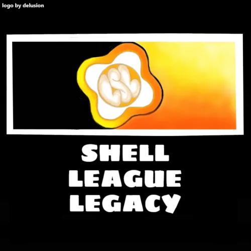

# Shell League Legacy Official Rules

## Table of Contents:

Refer to the sidebar on the left to navigate the document.

## 1. Introduction, Baseline Rules
  
The following rules are those set by the admins of the Shell League LEGACY Discord Server. To avoid issues, all participants should read and follow all these rules henceforth.

The rules laid out are enforced in addition to the [Discord Community Guidelines](https://discordapp.com/guidelines) and [Discord's TOS](https://discordapp.com/terms).

### 1.1 Personal information

No spreading of personal information without consent (such as names, family, identifying profiles, pictures, etc).

### 1.2 Who to contact

Contact Shell League LEGACY staff if issues arise. Those who wish to silently report misconduct will have protections such as confidentiality.

## 2. Rules of the Game

/so far undecided/

## 3. Server and Chat Rules

### 3.1 Language

English is the main language to be spoken in SLL, this is to ensure that the chat can be moderated by the staff on hand.

Inappropriate content such as sexual comments, harrassment, gore etc will be removed from chat.

Refrain from starting arguments arbitrarily. Try to remain respectful and civil in chat.

### 3.2 VCs

Speak English and do not be irritating.

### 3.3 Nicknames

Only staff may use staff tags.

Do not make your name something stupid like zalgo, lest it be reset.

Clan members must put their clan tags in front of their names (applies ingame too).

## 4. Hacking and Alting

### 4.1 Hacking

We do not permit the distribution of scripts such as game exploits.

Seemingly benign scripts should be vetted prior to sending links to their source. Posting code directly is prohibited.

### 4.2 Alting

We do not permit any alts to play in league games or be present in the server. When discovered, all known accounts will be punished.

Only the owner of an account is permitted to use it.

## 5. Punishments

### 5.1 Text Chat

Warnings will be given to spamming, advertising and using bot commands inappropriately.

Inappropriate content can result in a 1 month suspension.

Inciting drama/fights, spreading rumours or using politics can result in a temporary mute.

Threatening to nuke will result in a ban.

### 5.2 Cheating

Posting to cheat sources will result in a week's suspension.

Cheating in a game will result in a forfeit of the game and a suspension.

### 5.3 Foul Play

Team offences such as purposely throwing or colluding will result in forfeits and suspensions.

## 6. Appeals

### 6.1 Appeals

Submit appeals to a staff member.