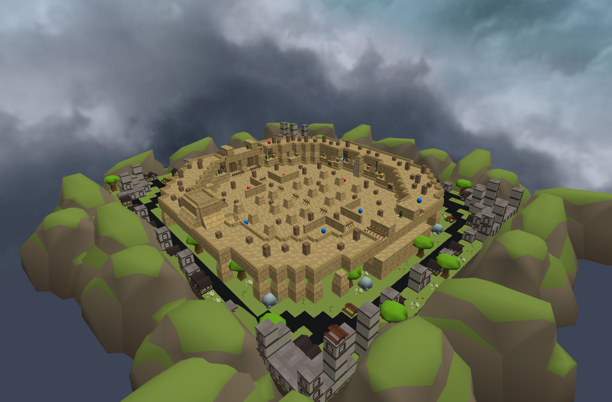
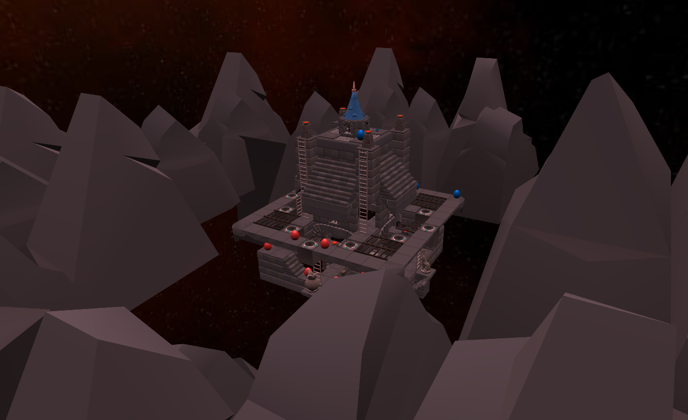
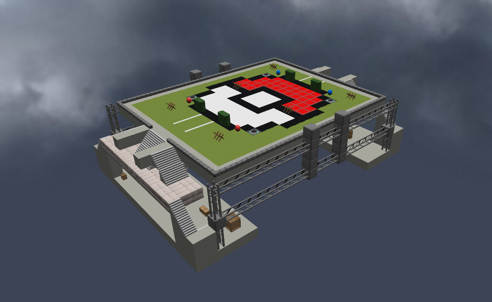
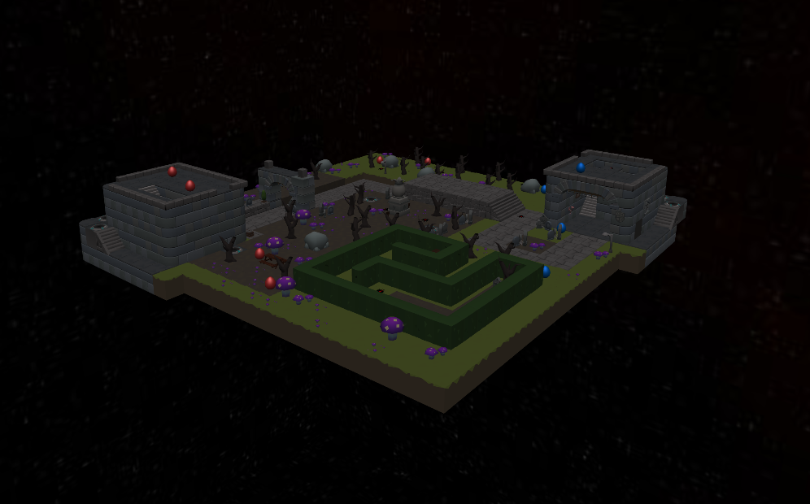
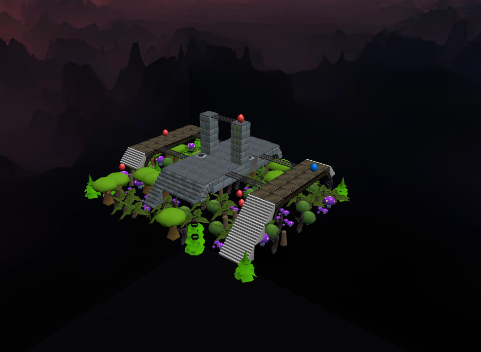
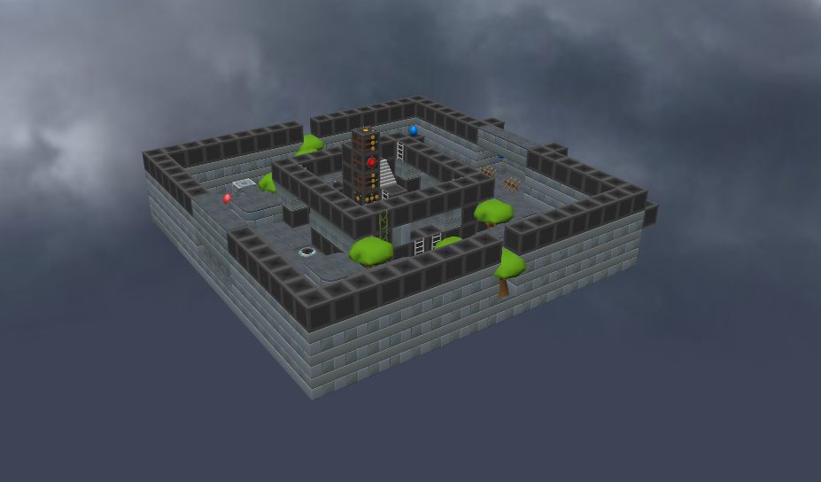
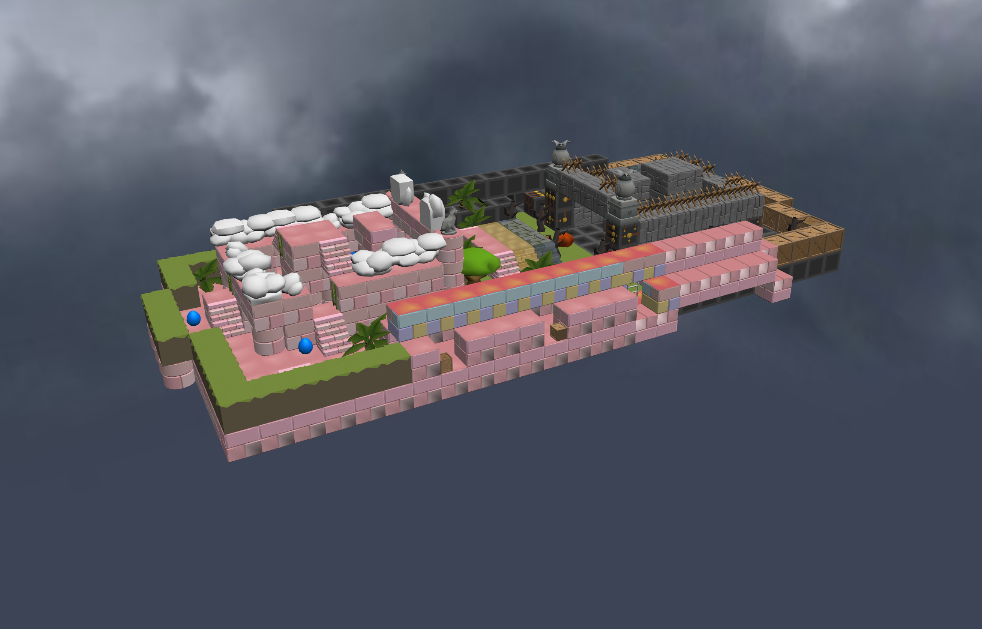
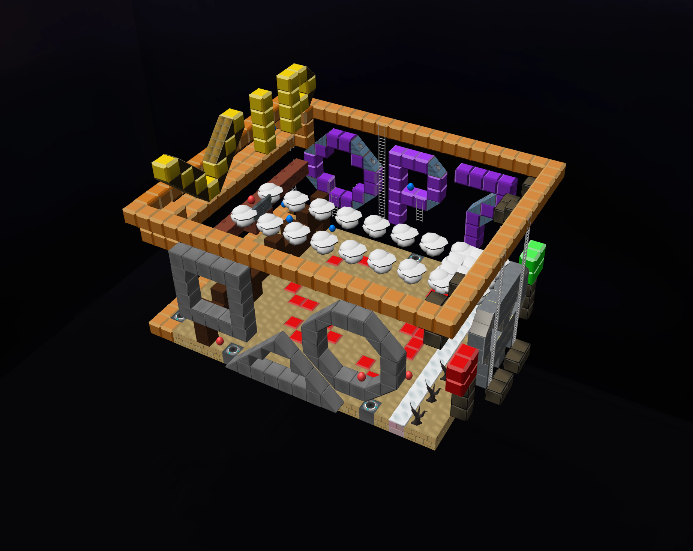
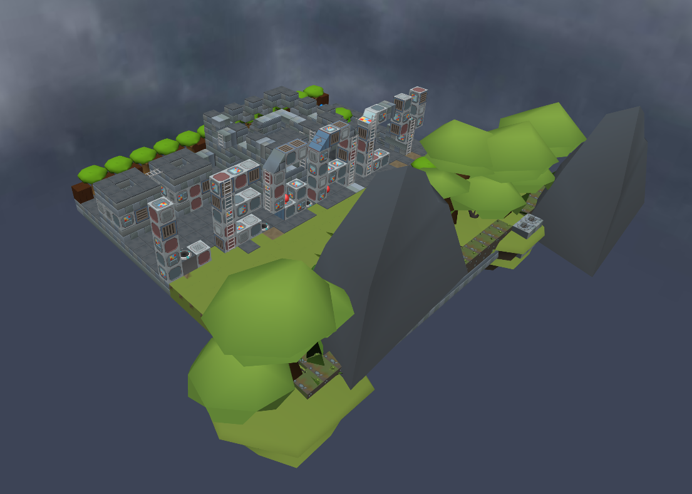

# Jan 2025 Map Competition Results

## Scores

|Name/Creator|Gallery|Scorings|Notes|
|------------|-------|--------|-----|
|The Colosseum by Lotex||Creativity: 4/5 Playability: 5/5 Design: 5/5
Total: 14/15|A very nice arena, which could be perfect for potential league games, with great angles for spectators to watch out of harm's way.|
|Egg Org's Castle by Lotex||Creativity: 4/5 Playability: 2/5 Design: 5/5
Total: 11/15|Although being too big to reasonably put into pubs, the scenery and paths in this map are very detailed and are fascinating to walk through.|
|Egglands by Lotex||Creativity: 4/5 Playability: 4/5 Design: 3/5
Total: 11/15|Seemingly based off Skywars maps, this turns Shell's map themes into a set of islands. It keeps most of the action concentrated, but a few elements seem haphazardly placed.|
|Red Shift by Seq||Creativity: 2/5 Playability: 4/5 Design: 4/5
Total: 10/15|This map has cool theming, jumps and a focused design.|
|Pokemon Arena by yurayura||Creativity: 3/5 Playability: 3/5 Design: 4/5
Total: 10/15|A simple yet striking design with enough obstacles to give the player a good degree of freedom in strategy.|
|Spooky Graveyard by DST Gamer||Creativity: 3/5 Playability: 2/5 Design: 4/5
Total: 9/15|Looks great, has a nice maze, but very flat...|
|Suspended Jungle by Kẹc||Creativity: 4/5 Playability: 2/5 Design: 4/5
Total: 9/15|The idea of a floating jungle is quite novel!|
|Legacy Arena by lemme mewing||Creativity: 3/5 Playability: 3/5 Design: 3/5
Total: 9/15|A nice arena stylistically, if a little similar to existing ones such as Space Arena.|
|Heggven by lemme mewing||Creativity: 3/5 Playability: 3/5 Design: 3/5
Total: 9/15|A perfectly simple map with what I can only summise as Heaven and Hell on each corner.|
|Squileggcy by Kẹc||Creativity: 3/5 Playability: 2/5 Design: 3/5
Total: 8/15|An interesting idea but has a lot of empty space, very impressive lettering however!|
|Legacy Kingdom by Kẹc||Creativity: 3/5 Playability: 2/5 Design: 2/5
Total: 7/15|Although it looks nice from afar, there isn't much gameplay here.|

## Results

### 3rd: Pokemon Arena by yurayura

Who knew a Pokéball would work so well as a map?

### 2nd: Spooky Graveyard by DST Gamer

Definitely one to bring out come October!

### 1st: The Colosseum by Lotex

A very well rounded (literally!) and unique map to play in, with great geometry and playability. Congratulations!

## Outcome

All the maps will be added to the game temporarily for a while. Maps which scored highly in playability will be added to the public map rotation:

- The Colosseum by Lotex
- Red Shift by Seq
- Egglands by Lotex
- Pokemon Arena by yurayura