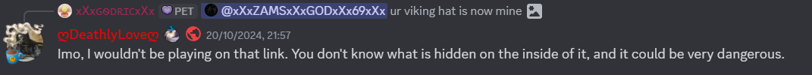

# LegacyShell's LinkExistenceHacking

Typically when you want to exploit someone, you need to find a vector to install malware on their computer. Usually this requires some sort of social engineering or exploitation of a vulnerability in software. But not for onlypuppy7, who has come up with a revolutionary new method: simply creating a link and existing.

Yes, you read that right. According to sources close to the hacker, they have discovered that if you create a link to a website or page on the internet, the mere act of that link's existence can hack people. It's not got anything to do with the content of the link, it's about its very presence in the universe.

"The beauty of this method is that it doesn't require any technical skills at all," says the hacker in an interview. "Anyone can do it. Just create a link and leave it there. Everyone in a chat room can get infected just by talking about the link."

*A concerned netizen warns others of the danger ahead.*

This new method of hacking has been dubbed "LinkExistenceHacking" or LEH for short. It's said to be incredibly effective because most people don't even realize that links on the internet exist until they've seen them. And once you've seen a link, it's hard to unsee it. As soon as someone talks about it in chat, it's already infected their computer.

The hacker claims it even hacks their body.

A citizen said: "I just created this link and then walked into the nearest coffee shop," they explain.  "People would talk about the link on their phones and I could feel my brain getting hacked. It was like my neurons were being rearranged."

So how does it work? Apparently, when you create a link, it sends out some sort of invisible signal that affects the quantum state of everyone who sees it. This causes their brain to rewire itself to obey your commands. It's a bit like hypnosis but with more code involved.

But the hacker claims that LEH is completely safe and harmless. "It's just really funny," onlypuppy7 said in an interview. "Imagine if you just go up to someone in real life, say the link name three times, and then they start doing some totally  useless task like walking around a tree."

*An example of a man who succumbed to LEH and got hacked by onlypuppy7 in real life.*

In conclusion LEH is the most powerful hacking method ever invented and it's just sitting here waiting to be used by anyone and we are all gonna die.